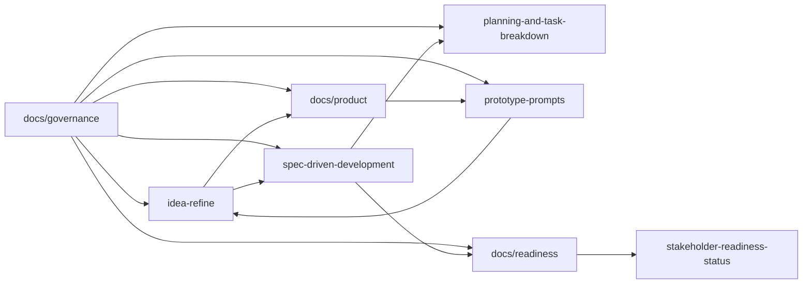

# Lifecycle And Promotion

This file defines how work moves across the repository.

## Purpose

The repository is organized into lanes, not just folders. Each lane has:

- a reason to exist
- a bounded set of decisions it may make
- required inputs and outputs
- promotion criteria for handing work to the next lane

Without that contract, the repo looks coherent while allowing silent scope drift.

## Lifecycle Overview

## Lane Contract

| Lane | Primary purpose | Consumes | Produces | May decide | Must inherit | Promotion criteria | Next stop |
| --- | --- | --- | --- | --- | --- | --- | --- |
| [../../idea-refine/](../../idea-refine/README.md) | turn a rough concept into a decision-worthy direction | raw idea, market observations, early assumptions, domain research | refined concept, hypotheses, pilot gate, prototype-and-eval loop | opportunity framing, option exploration, provisional recommendation | current canon, if it already exists; governance rules | product thesis is coherent, non-goals are explicit, open questions are named, pilot gate is defined | [../../spec-driven-development/README.md](../../spec-driven-development/README.md) and [../product/README.md](../product/README.md) |
| [../product/](../product/README.md) | define what prototypes, pilots, and reviews must cover | launch canon, prototype-and-eval plan, formal spec | pilot brief, prototype briefs, analytics/eval framing | discovery support and demo coverage | launch-slice boundary, policy rules, and authority model | each brief stays inside the canon, has clear questions to test, and maps to a prompt or pilot outcome | [../../prototype-prompts/README.md](../../prototype-prompts/README.md) |
| [../../prototype-prompts/](../../prototype-prompts/README.md) | generate constrained demo artifacts and stakeholder review material | launch canon, product briefs, analytics framing | prompt pack for prototypes, deck, one-pager, and refinement | presentation, prompt structure, and demo pacing | approved scope, policy, and non-goals | prompt pack mirrors the current briefs and does not invent scope | back to [../../idea-refine/pilot-decision-gate.md](../../idea-refine/pilot-decision-gate.md) with findings |
| [../../spec-driven-development/](../../spec-driven-development/README.md) | convert converged direction into a formal product contract and gated implementation plan | idea-refine outputs, launch canon, discovery support docs | spec, requirements, plan, stakeholder rubric | formal behavior, detailed constraints, launch-readiness requirements | governance rules and launch-canon summary | unresolved policy areas are explicit, downstream planning can proceed without hidden guesses, and stakeholder rubric is defined | [../../planning-and-task-breakdown/README.md](../../planning-and-task-breakdown/README.md) and [../readiness/README.md](../readiness/README.md) |
| [../../planning-and-task-breakdown/](../../planning-and-task-breakdown/README.md) | translate approved spec and plan into executable work | spec, requirements, plan, stakeholder rubric | tasks, dependencies, checkpoints, verification notes | sequencing, decomposition, verification intent | product scope and policy from the spec and canon | every task traces to approved upstream artifacts, no fake dependencies remain, and checkpoints are actionable | implementation tickets, workstreams, and launch-readiness packets |
| [../readiness/](../readiness/README.md) | turn stakeholder rubric into concrete launch packets | stakeholder-readiness policy, launch canon, requirements, plan, analytics schema | reviewable packets by function group | packet structure, required evidence, named open decisions | stakeholder rubric and launch-slice scope | every critical function has a packet template, expected evidence, and a path into the status snapshot | [../../spec-driven-development/stakeholder-readiness-status.md](../../spec-driven-development/stakeholder-readiness-status.md) |
| [docs/governance](README.md) | keep the system operable and portable | all lane definitions | authority rules, change control, linking standard, traceability | repo process only | none | governance docs stay aligned with real repo structure | every other lane |

## Promotion Checklist

Use this checklist when work is promoted from one lane to the next:

- problem framing is explicit
- launch slice and non-goals are named
- unresolved assumptions are listed instead of hidden
- current authority source is linked
- downstream consumer is named explicitly
- status impacts are known before promotion
- any policy or scope change has a matching update in [../launch-canon.md](../launch-canon.md) and affected downstream docs

## Anti-Patterns

The following are not acceptable promotion mechanisms:

- “the next folder will infer the intent”
- “the prompt will decide the missing policy”
- “the task list can fill in the unresolved product rule later”
- “the status doc is close enough to the rubric”

If any of those are happening, stop and route the change through [change-control-checklist.md](change-control-checklist.md).
