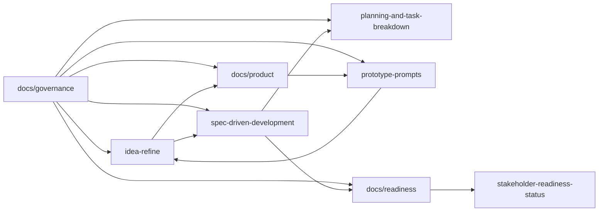

# System Map

This file is the fastest way to answer two questions:

1. Where should I read first for a specific question?
2. Which artifact is allowed to decide that question?

Use it before editing the repo if you do not already know the lane model.

## Read Order

For most contributors, the safest read order is:

1. [README.md](README.md)
2. [launch-canon.md](launch-canon.md)
3. [governance/authority-boundaries.md](governance/authority-boundaries.md)
4. the lane README you plan to edit
5. the highest-authority artifact inside that lane

## Question-To-Authority Map

| If you need to answer... | Start here | Then read | Notes |
| --- | --- | --- | --- |
| What is the current launch wedge and launch slice? | [launch-canon.md](launch-canon.md) | [../idea-refine/pilot-synthesis-status.md](../idea-refine/pilot-synthesis-status.md), [../spec-driven-development/spec.md](../spec-driven-development/spec.md) | `launch-canon.md` is the concise cross-folder summary. |
| What is exploratory versus implementation-binding? | [governance/authority-boundaries.md](governance/authority-boundaries.md) | the relevant lane README | If two docs disagree, use the higher-authority source and update the lower one. |
| What problem are we solving and what is still unproven? | [../idea-refine/README.md](../idea-refine/README.md) | [../idea-refine/pet-grooming-booking-platform.md](../idea-refine/pet-grooming-booking-platform.md), [../idea-refine/pilot-decision-gate.md](../idea-refine/pilot-decision-gate.md) | `idea-refine/` owns the exploratory voice. |
| What behavior is formally required? | [../spec-driven-development/requirements.md](../spec-driven-development/requirements.md) | [../spec-driven-development/spec.md](../spec-driven-development/spec.md) | `requirements.md` defines requirement families; `spec.md` defines the detailed behavior contract. |
| What is the implementation order and risk posture? | [../spec-driven-development/plan.md](../spec-driven-development/plan.md) | [../planning-and-task-breakdown/tasks.md](../planning-and-task-breakdown/tasks.md) | `plan.md` owns sequencing. `tasks.md` decomposes work. |
| What evidence is still required before deep build or launch? | [../idea-refine/pilot-decision-gate.md](../idea-refine/pilot-decision-gate.md) | [../spec-driven-development/stakeholder-readiness.md](../spec-driven-development/stakeholder-readiness.md), [../spec-driven-development/stakeholder-readiness-status.md](../spec-driven-development/stakeholder-readiness-status.md) | Discovery lock and launch readiness are separate gates. |
| What should the prototypes and demo prompts express? | [product/README.md](product/README.md) | [../prototype-prompts/README.md](../prototype-prompts/README.md) | Product briefs define coverage; prompts package that coverage for Claude Design. |
| Which file should I update when a rule changes? | [governance/change-control-checklist.md](governance/change-control-checklist.md) | [governance/traceability-index.md](governance/traceability-index.md) | Update the highest-authority artifact first, then downstream consumers in the same change. |
| Which terms are canonical in this repo? | [governance/terminology-canon.md](governance/terminology-canon.md) | [launch-canon.md](launch-canon.md) | Do not invent synonyms for core product objects. |
| What quality bar should a new doc or prompt meet? | [governance/document-quality-standard.md](governance/document-quality-standard.md) | the relevant lane README | Use the artifact-type contract instead of improvising format. |

## Lane Flow

## Edit Rule

Before you change a file:

- confirm the authority level in [governance/authority-boundaries.md](governance/authority-boundaries.md)
- confirm the expected structure in [governance/document-quality-standard.md](governance/document-quality-standard.md)
- confirm the canonical language in [governance/terminology-canon.md](governance/terminology-canon.md)
- confirm downstream impact in [governance/change-control-checklist.md](governance/change-control-checklist.md)

If you cannot state which artifact owns the decision, do not patch downstream prose first.
